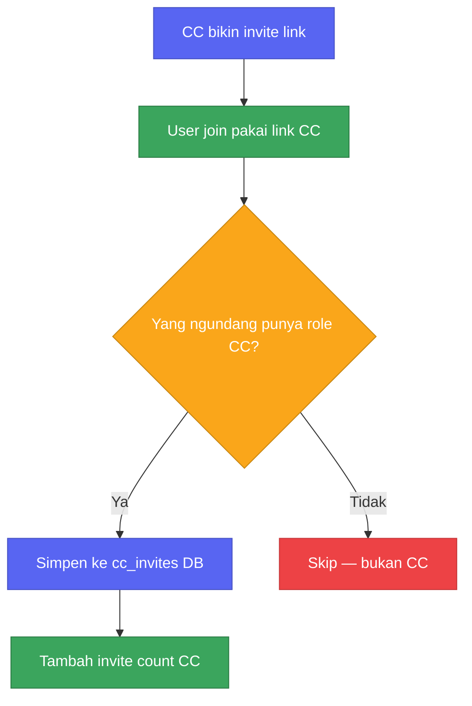
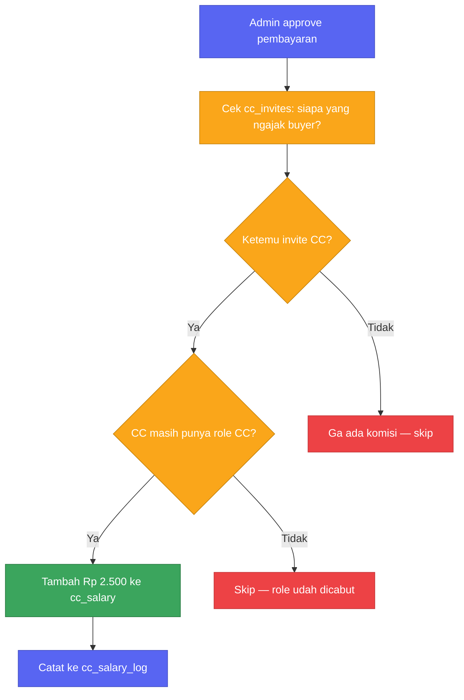
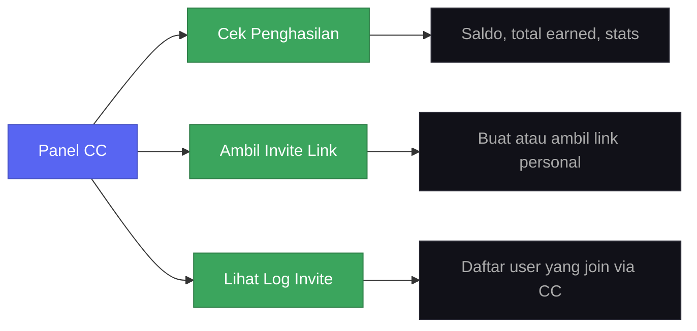
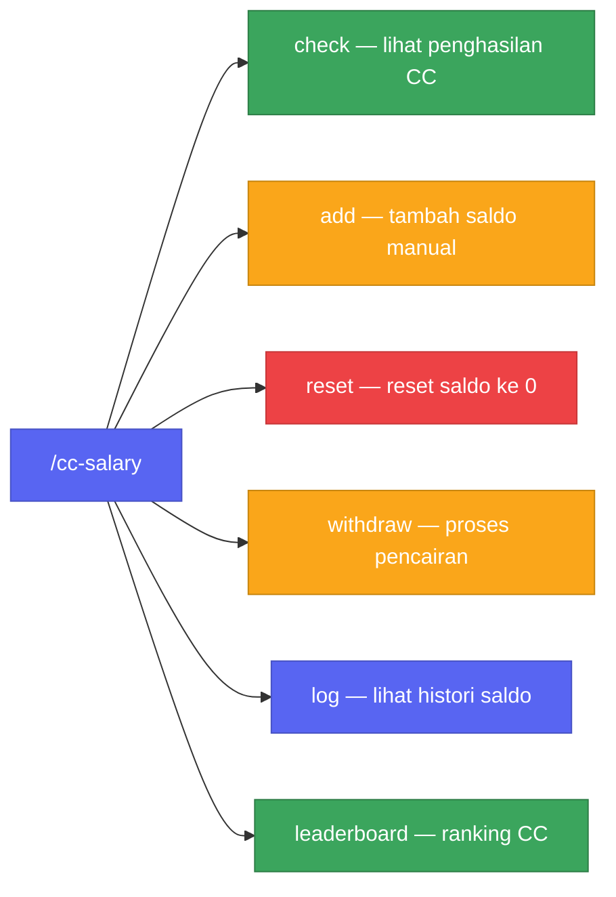

Mulai 20 April, setiap CC yang berhasil ngajak member beli script bakal otomatis dapet komisi Rp 2.500 per transaksi. Ga perlu laporan manual, ga perlu ngejar siapa-siapa. Dan ini pertama kalinya CC dibayar di server ini.

---

## Kenapa baru sekarang?

Jujur aja, sebelumnya memang ga ada sistem gaji untuk CC sama sekali. CC ngajak orang masuk, orang itu beli, tapi CC ga dapet apa-apa. Kita tau itu ga adil, cuma ya... ga ada yang pernah bikin sistemnya.

Ga ada yang komplain juga, karena ga ada yang sadar harusnya ada sistem. Baru pas kita kepikiran "harusnya CC dikasih sesuatu", baru kerasa — kita bahkan ga punya cara buat ngitungnya.

Siapa ngajak siapa? Ga ada data. Ga pernah dicatat.

Jadi sekalian dibangun dari nol.

---

## 1. Tracking invite member

Setiap ada user baru join, bot langsung ngecek: dia masuk pake invite siapa? Siapa yang bikin link itu? Kalau pembuatnya punya role CC, relasi itu langsung disimpan.

CC ga perlu ngapa-ngapain, semua jalan otomatis di background.

Kita sengaja ga ngecek eligibility CC saat join, karena role bisa berubah kapan aja. Lebih aman dicek pas momen pembayaran.

---

## 2. Alur komisi pembayaran

Setiap admin approve pembayaran, sistem langsung ngecek apakah ada CC yang ngajak buyer tersebut.

Kalau ada dan CC-nya masih aktif, Rp 2.500 langsung masuk ke saldo mereka dan dicatat. Kalau role-nya udah dicabut, ya ga dapet komisi. Simpel.

Setiap komisi punya referensi ke transaksi yang memicunya. Jadi kalau ada CC nanya “kok saldo saya segini?”, semuanya bisa ditrace.

Kita pake flat rate, bukan persentase. Soalnya harga script udah standar, dan ini jauh lebih gampang dijelasin ke semua orang.

---

## 3. Panel CC

Semua akses CC ada di panel tombol. Ga ada slash command ribet, tinggal klik.

**Cek Penghasilan** — saldo sekarang, total earning, dan jumlah invite. Satu layar, beres.

**Ambil Invite Link** — klik sekali, dapet link personal. Permanen, ga ada expiry.

**Lihat Log Invite** — lihat siapa aja yang join lewat link CC + siapa yang udah beli. Bisa langsung keliatan conversion rate real.

Semua response ephemeral — cuma kelihatan ke CC itu sendiri.

---

## 4. Command manager

Manager punya `/cc-salary` buat handle semuanya.

`check` — cek saldo & stats CC mana aja.

`add` — tambah komisi manual (misalnya dari DM / luar sistem). Ditandai `manual` di log.

`reset` — nol-in saldo setelah payout. Manual, ga pernah otomatis.

`withdraw` — catat pencairan + kirim notifikasi ke CC.

`log` — histori lengkap semua transaksi saldo.

`leaderboard` — ranking CC berdasarkan earning. Reset tiap bulan.

---

## Bagaimana data disimpan

Semua data disimpan di PostgreSQL:

* `cc_invites` — siapa ngajak siapa (ga pernah dihapus)
* `cc_salary` — saldo aktif + total earning
* `cc_salary_log` — semua histori (append-only, ga pernah diedit)

Bot ga pake cache member/role Discord (sengaja dimatiin buat hemat memori). Semua pengecekan role pakai REST fetch langsung, jadi selalu akurat walaupun bot restart.

---

Sistem ini aktif mulai 20 April. Kalau ada pertanyaan terkait cara kerja invite atau proses pencairan, langsung tanyakan di channel CC sebelum tanggal tersebut.

