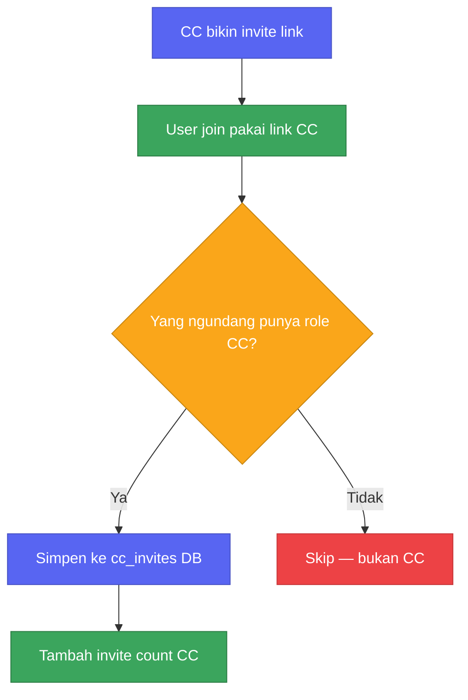
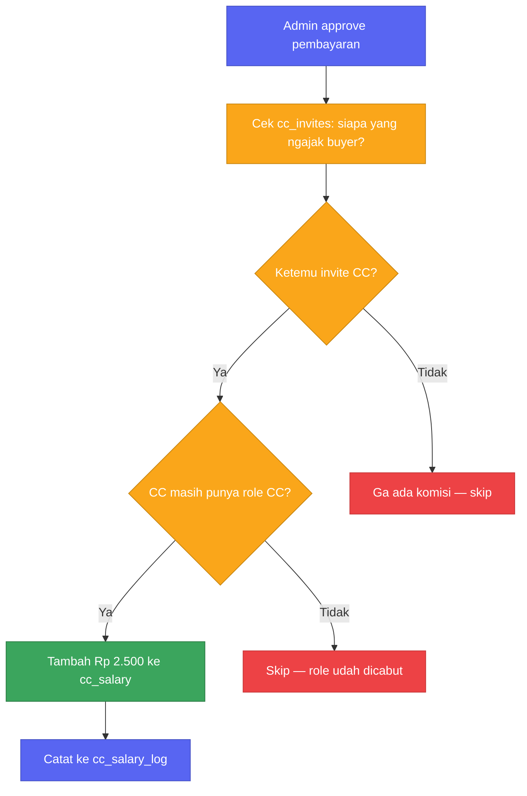
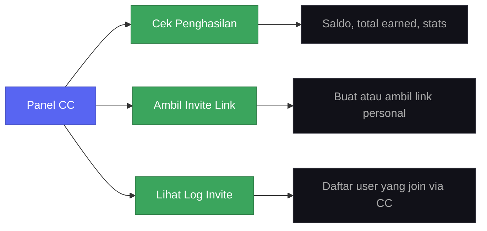
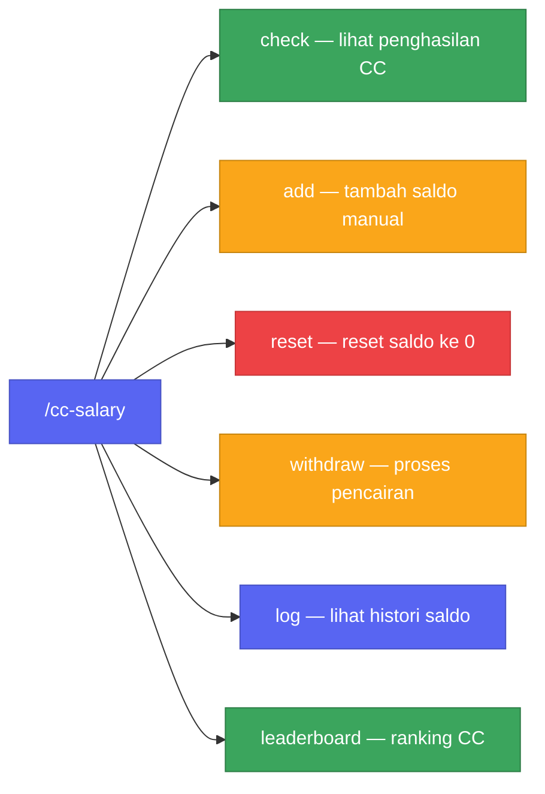

Mulai 20 April, setiap CC yang berhasil ngajak member beli script bakal otomatis dapet komisi Rp 2.500 per transaksi. Tidak perlu laporan manual, tidak perlu ngejar siapapun. Dan ini pertama kalinya CC dibayar di server ini.

---

## Kenapa baru sekarang?

Jujur aja, sebelumnya tidak ada sistem gaji untuk CC sama sekali. CC ngajak orang masuk, orang itu beli, tapi CC tidak dapat apa-apa. Kita tahu itu tidak adil, hanya saja tidak ada yang pernah bikin sistemnya.

Tidak ada yang komplain karena tidak ada yang tahu seharusnya ada sistem. Baru waktu kita mulai mikir "harusnya CC dikasih sesuatu" kita sadar tidak ada cara untuk ngitungnya. Siapa yang ngajak siapa? Tidak ada data. Tidak pernah dicatat.

Jadi ya, dibangun dari nol sekalian.

---

## 1. Tracking invite member

Setiap ada user baru bergabung ke server, bot langsung ngecek: link invite mana yang dipakai? Siapa yang bikin link itu? Kalau pembuatnya punya role CC, relasi itu langsung disimpan sebagai "user ini dibawa oleh CC ini."

CC tidak perlu melakukan apa-apa, tracking jalan otomatis di background. Kita sengaja tidak mengecek eligibility CC pada saat join karena status CC bisa berubah kapan saja. Lebih aman dicek langsung di momen pembayaran.

---

## 2. Alur komisi pembayaran

Setiap admin menyetujui pembayaran, sistem langsung ngecek apakah ada CC yang ngajak pembeli tersebut.

Kalau ada dan CC-nya masih aktif (masih punya rolenya), Rp 2.500 langsung masuk ke saldo mereka dan kejadiannya dicatat. Kalau rolenya sudah dicabut, tidak ada komisi yang keluar. Simpel.

Setiap komisi disimpan dengan referensi ke transaksi yang memicunya. Jadi kalau ada CC yang nanya "kok saldo saya segini?", kita bisa trace setiap Rp 2.500 balik ke pembelian spesifiknya.

Kita pilih flat rate daripada persentase karena harga script sudah standar, dan flat rate jauh lebih gampang dijelaskan ke semua pihak.

---

## 3. Panel CC

CC bisa akses semuanya lewat panel tombol di channel khusus. Tidak ada slash command yang perlu dihafalkan, cukup tekan tombol.

Cek Penghasilan — menampilkan saldo saat ini, total yang pernah diterima, dan jumlah invite. Satu layar, tidak perlu buka spreadsheet.

Ambil Invite Link — klik sekali, dapat link personal. Bot membuat link permanen yang terikat ke akun, jadi setiap kali tombol ini ditekan selalu menghasilkan link yang sama. Tidak ada expiry, aman dipasang di konten tanpa khawatir link mati keesokan harinya.

Lihat Log Invite — daftar siapa saja yang bergabung lewat link CC, lengkap dengan info apakah mereka sudah beli. Berguna untuk lihat conversion rate yang sebenarnya, bukan sekadar angka invite.

Semua respons bersifat ephemeral, hanya terlihat oleh CC yang bersangkutan.

---

## 4. Command manager

Manager punya command group `/cc-salary` untuk keperluan administratif.

`check` — lihat saldo dan statistik CC manapun. Berguna saat ada dispute atau kasus support yang perlu konfirmasi data.

`add` — tambah komisi manual untuk kasus referral yang terjadi di luar sistem, misalnya via DM atau media sosial. Tercatat di log dengan tag `manual` supaya bisa dibedakan dari yang otomatis.

`reset` — nol-in saldo CC setelah transfer dikonfirmasi sudah dikirim. Selalu dilakukan manual oleh manager, tidak pernah otomatis. (Karena otomatis itu scary.)

`withdraw` — catat pencairan sebagai selesai beserta referensi transaksinya. CC langsung dapat notifikasi setelah prosesnya beres.

`log` — seluruh riwayat aktivitas saldo CC: setiap komisi masuk, tambahan manual, pencairan, semua ada timestamp-nya.

`leaderboard` — peringkat CC berdasarkan total penghasilan. Reset setiap bulan, top 3 dapat shoutout di channel announcements.

---

## Bagaimana data disimpan

Semua data tersimpan di PostgreSQL dalam tiga tabel:

- `cc_invites` — relasi siapa ngajak siapa. Tidak pernah dihapus meskipun user sudah keluar dari server, karena mereka bisa balik kapan saja.
- `cc_salary` — satu baris per CC, berisi saldo aktif dan total lifetime earning.
- `cc_salary_log` — log append-only untuk seluruh aktivitas saldo. Tidak ada yang diedit atau dihapus di sini. Ini audit trail-nya.

Bot tidak pernah membaca cache member atau role Discord karena cache-nya memang dinonaktifkan untuk efisiensi memori. Setiap pengecekan role menggunakan REST fetch langsung, jadi datanya selalu akurat meskipun bot baru saja restart.

---

Sistem ini aktif mulai 20 April. Kalau ada pertanyaan soal cara kerja invite atau proses pencairan, tanyakan di channel CC sebelum tanggal tersebut.

---

Sistem ini aktif mulai 20 April. Jika ada pertanyaan terkait cara kerja invite atau proses pencairan, silakan tanyakan di channel CC sebelum tanggal tersebut.

