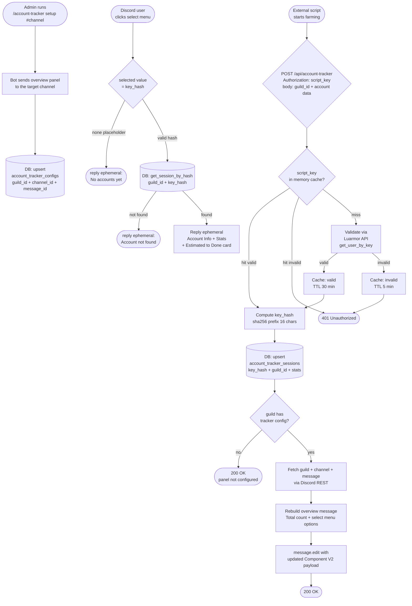

```mermaid
flowchart TD
    A([Admin runs\n/account-tracker setup #channel]) --> B[Bot sends overview panel\nto the target channel]
    B --> C[(DB: upsert\naccount_tracker_configs\nguild_id + channel_id + message_id)]

    D([External script\nstarts farming]) --> E{POST /api/account-tracker\nAuthorization: script_key\nbody: guild_id + account data}

    E --> F{script_key\nin memory cache?}
    F -- hit valid --> H
    F -- hit invalid --> Z([401 Unauthorized])
    F -- miss --> G[Validate via\nLuarmor API\nget_user_by_key]

    G -- valid --> G1[Cache: valid\nTTL 30 min] --> H
    G -- invalid --> G2[Cache: invalid\nTTL 5 min] --> Z

    H[Compute key_hash\nsha256 prefix 16 chars]
    H --> I[(DB: upsert\naccount_tracker_sessions\nkey_hash + guild_id + stats)]

    I --> J{guild has\ntracker config?}
    J -- no --> R([200 OK\npanel not configured])
    J -- yes --> K[Fetch guild + channel + message\nvia Discord REST]

    K --> L[Rebuild overview message\nTotal count + select menu options]
    L --> M[message.edit with\nupdated Component V2 payload]
    M --> R2([200 OK])

    N([Discord user\nclicks select menu]) --> O{selected value\n= key_hash}
    O -- none placeholder --> P([reply ephemeral:\nNo accounts yet])
    O -- valid hash --> Q[(DB: get_session_by_hash\nguild_id + key_hash)]
    Q -- not found --> P2([reply ephemeral:\nAccount not found])
    Q -- found --> S[Reply ephemeral\nAccount Info + Stats\n+ Estimated to Done card]
```
